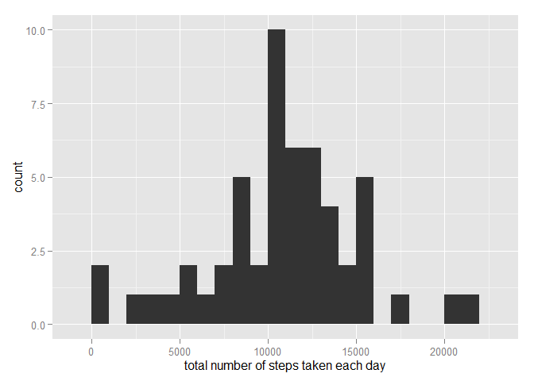
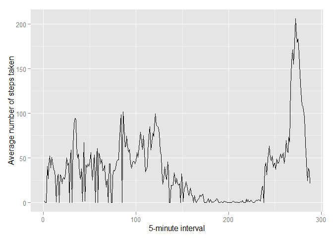
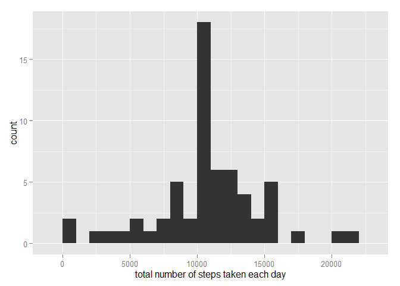
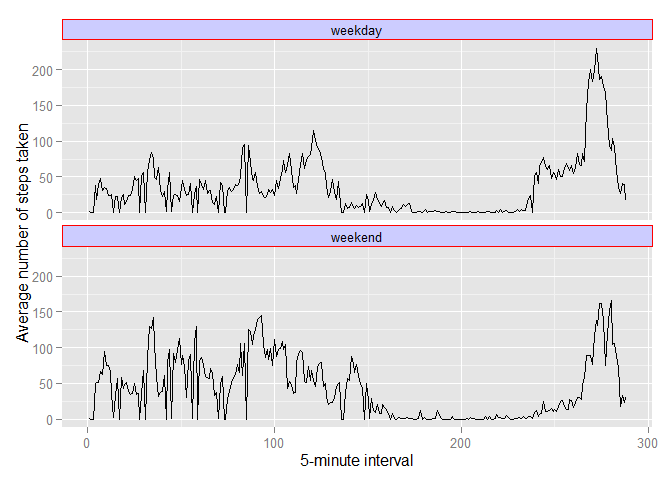

# Reproducible Research: Peer Assessment 1


## Loading and preprocessing the data

```r
library(plyr)
library(dplyr)
library(data.table)
library(ggplot2)

echo = TRUE  
options(scipen = 1)  
projectDir="C:/Downloads/Courses/JohnHopkins/ReproducibleResearch/Week1/project"
setwd(projectDir)
#####
unzip("activity.zip")
```

```
## Warning in unzip("activity.zip"): error 1 in extracting from zip file
```

```r
####
activity<- read.csv("activity.csv", sep=",",header=TRUE, colClasses = c("integer", "Date", "factor"))
activity$month <- as.numeric(format(activity$date, "%m"))
activity$interval<-as.numeric(activity$interval)
activity$date <- as.Date(activity$date) 

noNA <- na.omit(activity)
rownames(noNA) <- 1:nrow(noNA)
```

## What is mean total number of steps taken per day?

```r
activityTable<-as.data.table(activity)
#
# Calculate the total number of steps taken per day
#
totalSteps<-activityTable[,sum(steps),by=date]
names(totalSteps)<-c("date","steps")
#
# Make a histogram of the total number of steps taken each day
#
qplot(totalSteps$steps, binwidth = 1000, xlab = "total number of steps taken each day")
```



```r
#
#What is mean total number of steps taken per day? What is the median?
#
 totalSteps[is.na(totalSteps$steps)]<-0
mean(totalSteps$steps)
```

```
## [1] 9354.23
```

```r
median(totalSteps$steps)
```

```
## [1] 10395
```
## What is the average daily activity pattern?

```r
#
#Make a time series plot (i.e. type = "l") of the 5-minute interval (x-axis) and the average number of steps taken, averaged across all days (y-axis)
#
library(ggplot2) 
avgs <- aggregate(x=list(steps=activity$steps), by=list(interval=activity$interval), 
                      FUN=mean, na.rm=TRUE) 
ggplot(data=avgs, aes(x=interval, y=steps,ymax=max(steps))) + 
    geom_line(position=position_dodge(.1),aes(group=0)) + 
    xlab("5-minute interval") + 
    ylab("Average number of steps taken")
```



```r
#
#Which 5-minute interval, on average across all the days in the dataset, contains the maximum number of steps?
#
avgs[which.max(avgs$steps),]
```

```
##     interval    steps
## 272      272 206.1698
```
## Imputing missing values

```r
#
#Calculate and report the total number of missing values in the dataset (i.e. the total number of rows with NAs)
#
table(is.na(activity$steps))[2]
```

```
## TRUE 
## 2304
```

```r
#
#Devise a strategy for filling in all of the missing values in the dataset. Calculate mean and populate.
#
# Replace each missing value with the mean value of its 5-minute interval
#
fillValue <- function(steps, interval) { 
     val <- NA 
     if (!is.na(steps)) 
         val <- c(steps) 
     else 
         val <- (avgs[avgs$interval==interval, "steps"]) 
     return(val) 
 } 

#
#Create a new dataset that is equal to the original dataset but with the missing data filled in.
#
filledActivity <- activity 
filledActivity$steps <- mapply(fillValue, filledActivity$steps, filledActivity$interval) 
filledActivityTable<-as.data.table(filledActivity)
#
# Calculate the total number of steps taken per day
#
totalStepsNew<-filledActivityTable[,sum(steps),by=date]
names(totalStepsNew)<-c("date","steps")
#
# Make a histogram of the total number of steps taken each day
#
qplot(totalStepsNew$steps, binwidth = 1000, xlab = "total number of steps taken each day")
```



```r
# 
# Calculate mean and median
#
mean(totalStepsNew$steps)
```

```
## [1] 10766.19
```

```r
median(totalStepsNew$steps)
```

```
## [1] 10766.19
```
## Are there differences in activity patterns between weekdays and weekends?

```r
#
# Create a new factor variable in the dataset with two levels – “weekday” and “weekend” indicating whether a given date is a weekday or weekend day.
#
## ------------------------------------------------------------------------ 
 weekday.or.weekend <- function(date) { 
     day <- weekdays(date) 
     if (day %in% c("Monday", "Tuesday", "Wednesday", "Thursday", "Friday")) 
         return("weekday") 
     else if (day %in% c("Saturday", "Sunday")) 
         return("weekend") 
     else 
         stop("invalid date") 
} 
#filledActivityTable$date <- as.Date(filledActivityTable$date) 
filledActivityTable$day <- sapply(filledActivityTable$date, FUN=weekday.or.weekend) 

#
# Make a panel plot containing a time series plot (i.e. type = "l") of the 5-minute interval (x-axis) and the average number of steps taken, averaged across all weekday days or weekend days (y-axis).
#
library(ggplot2) 
plot.new()
```


```r
avgs <- aggregate(x=list(steps=filledActivityTable$steps), by=list(interval=filledActivityTable$interval,filledActivityTable$day), 
                      FUN=mean, na.rm=TRUE)
 
ggplot(avgs, aes(interval, steps)) + 
    geom_line(position=position_dodge(0)) +
    facet_wrap(~ Group.2 , scales = "fixed",ncol=1) + 
    theme(strip.background = element_rect(colour="red", fill="#CCCCFF"))+
    xlab("5-minute interval") + 
    ylab("Average number of steps taken") 
```

```
## ymax not defined: adjusting position using y instead
## ymax not defined: adjusting position using y instead
```



```r
##
```
Yes. Looking at the graphs we can say that there is a variation in the activities between weekdays and weekends
## 

